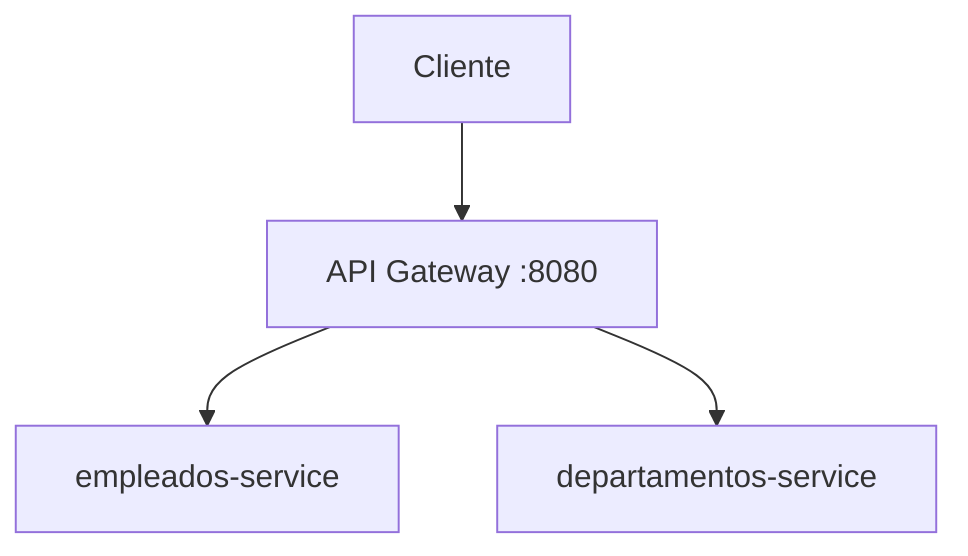

# API Gateway

API Gateway independiente de la plataforma RHM. Recibe las solicitudes HTTP de los clientes y las enruta hacia los microservicios de empleados y departamentos, manteniendo al Gateway como punto de entrada externo.

## Arquitectura



El Gateway no contiene lógica de negocio, acceso a bases de datos ni validaciones de empleados o departamentos. Su responsabilidad es actuar como proxy HTTP entre el cliente y los servicios upstream.

En la integración Docker Compose actual, los destinos internos son:

- `empleados-service:8080`
- `departamentos-service:80`

## Responsabilidades

El Gateway:

- recibe solicitudes de los clientes;
- enruta las solicitudes a los microservicios configurados;
- conserva el método HTTP, la ruta, los parámetros de consulta, los headers y el body cuando corresponde;
- devuelve la respuesta del servicio upstream;
- responde con `503 Service Unavailable` cuando un upstream no está disponible;
- proporciona su propio endpoint de salud.

## Rutas

Las rutas se definen en `src/server.ts`.

| Ruta | Destino | Descripción |
|---|---|---|
| `GET /health` | API Gateway | Comprueba que el Gateway está disponible. |
| `/empleados/*` | `EMPLEADOS_SERVICE_URL` | Proxy hacia el servicio de empleados. El Gateway no restringe el método HTTP; el servicio destino procesa la solicitud. |
| `/departamentos/*` | `DEPARTAMENTOS_SERVICE_URL` | Proxy hacia el servicio de departamentos. El Gateway no restringe el método HTTP; el servicio destino procesa la solicitud. |

Las rutas proxy utilizan `http-proxy-middleware` con `changeOrigin: true` y conservan la ruta solicitada.

## Variables de entorno

`.env.example` muestra las variables utilizadas por el servicio.
`PORT` es opcional porque utiliza `8080` por defecto. Las variables
`EMPLEADOS_SERVICE_URL` y `DEPARTAMENTOS_SERVICE_URL` deben estar
definidas y contener URLs válidas.

| Variable | Descripción | Ejemplo |
|---|---|---|
| `PORT` | Puerto HTTP donde escucha el Gateway. Si no se define, la aplicación usa `8080`. | `8080` |
| `EMPLEADOS_SERVICE_URL` | URL base del servicio de empleados. | `http://empleados-service:8080` |
| `DEPARTAMENTOS_SERVICE_URL` | URL base del servicio de departamentos. | `http://departamentos-service:80` |

Las URLs se validan al iniciar. El Gateway no carga automáticamente un archivo `.env`; las variables deben estar disponibles en el entorno del proceso o ser proporcionadas por Docker Compose.

## Puerto

El valor utilizado actualmente es:

```env
PORT=8080
```

En la integración actual documentada por el repositorio de infraestructura,
el Gateway se publica en el puerto `8080`. Esta configuración pertenece al
`docker-compose.yml` externo, no a este repositorio. Los microservicios permanecen dentro de la red Docker y sus URLs internas se proporcionan mediante `EMPLEADOS_SERVICE_URL` y `DEPARTAMENTOS_SERVICE_URL`.

## Health Check

Solicitud:

```http
GET /health
```

Respuesta:

```json
{
  "success": true,
  "message": "API Gateway disponible",
  "data": {
    "status": "UP"
  }
}
```

El `Dockerfile` utiliza este endpoint para su healthcheck.

## Manejo de errores

Si el proxy no puede comunicarse con el servicio upstream, responde con
HTTP `503`. Si el upstream responde con un código HTTP válido, el Gateway
reenvía esa respuesta.

Cuando ocurre un error de comunicación con el upstream, la respuesta utiliza
el siguiente formato:

```json
{
  "success": false,
  "message": "Servicio upstream no disponible",
  "data": null,
  "error": {
    "code": "UPSTREAM_SERVICE_UNAVAILABLE"
  }
}
```

Las rutas no reconocidas por el Gateway responden con HTTP `404` y el código `RESOURCE_NOT_FOUND`.

## Instalación local

Requisitos:

- Node.js compatible con el proyecto;
- npm.

Instalar dependencias:

```bash
npm install
```

Antes de iniciar localmente, definir las tres variables de entorno. Por ejemplo, en PowerShell:

```powershell
$env:PORT="8080"
$env:EMPLEADOS_SERVICE_URL="http://localhost:8080"
$env:DEPARTAMENTOS_SERVICE_URL="http://localhost:8081"
```

Las URLs anteriores son solo un ejemplo para ejecutar el Gateway con servicios accesibles desde el entorno local. En Docker Compose se utilizan los nombres DNS internos definidos en `.env.example`.

## Desarrollo y ejecución

Scripts disponibles en `package.json`:

```bash
npm run dev
npm start
npm run typecheck
npm run build
```

- `npm run dev`: ejecuta el servidor con watch y `--experimental-strip-types`.
- `npm start`: ejecuta `dist/server.js`; requiere haber compilado previamente.
- `npm run typecheck`: verifica los tipos sin generar archivos.
- `npm run build`: compila `src` en `dist`.

Para ejecutar la versión compilada:

```bash
npm run build
npm start
```

## Ejecución con Docker

El `Dockerfile` usa una construcción multietapa basada en Node.js 24 Alpine. Instala las dependencias con `npm ci`, compila TypeScript, elimina dependencias de desarrollo y ejecuta `dist/server.js` con un usuario no privilegiado.

Construir la imagen desde este repositorio:

```bash
docker build -t api-gateway .
```

Para ejecutar el contenedor de forma independiente, las variables
`EMPLEADOS_SERVICE_URL` y `DEPARTAMENTOS_SERVICE_URL` deben apuntar a
upstreams realmente accesibles desde el contenedor.

No se deben apuntar al puerto publicado por el propio Gateway. En Docker
Compose, se deben utilizar los nombres DNS de los servicios de la red
compartida.

## Integración con Docker Compose

El Gateway es un repositorio independiente. El repositorio `rhm-database-infrastructure` lo consume como contexto de construcción mediante:

```yaml
api-gateway:
  build:
    context: ../api-gateway
    dockerfile: Dockerfile
```

El `docker-compose.yml` no pertenece a este repositorio. Desde `rhm-database-infrastructure`, el Gateway se conecta a `microservices-network` y recibe:

```yaml
PORT: 8080
EMPLEADOS_SERVICE_URL: http://empleados-service:8080
DEPARTAMENTOS_SERVICE_URL: http://departamentos-service:80
```

El Gateway es el único punto de entrada HTTP de la plataforma publicado al host. Los microservicios no publican directamente sus puertos HTTP.

## Verificación

Con el Gateway ejecutándose localmente o mediante Compose:

```bash
curl -i http://localhost:8080/health
curl -i http://localhost:8080/empleados
curl -i http://localhost:8080/departamentos
```

La primera solicitud comprueba el Gateway. Las otras dos comprueban el proxy hacia los microservicios. En Compose, los upstreams se consumen internamente mediante nombres de servicio Docker.

## Relación con el Reto 3

Como parte del Reto 3, el Gateway fue separado del repositorio de infraestructura y publicado como un repositorio independiente. La infraestructura lo incorpora mediante el contexto relativo `../api-gateway`.

La arquitectura final mantiene:

- el Gateway como punto de entrada externo;
- empleados y departamentos como servicios internos;
- comunicación entre contenedores mediante nombres de servicio Docker;
- ningún puerto HTTP de los microservicios publicado directamente al host.

El Circuit Breaker pertenece a `ms-employees`, que es el servicio consumidor de departamentos. No forma parte de este Gateway.

## Repositorios relacionados

- [API Gateway](https://github.com/Microservicios-RHM/api-gateway)
- [Infraestructura](https://github.com/Microservicios-RHM/rhm-database-infrastructure)
- [Employees](https://github.com/Microservicios-RHM/ms-employees)
- [Departments](https://github.com/Microservicios-RHM/ms-departments)

## Decisiones de diseño

- El Gateway se mantiene como repositorio independiente para separar su ciclo de vida del repositorio de infraestructura.
- La comunicación en Docker utiliza nombres DNS de servicios, como `empleados-service` y `departamentos-service`.
- El Gateway concentra el acceso HTTP externo en el puerto `8080`.
- Los microservicios mantienen sus puertos HTTP internos y no se publican directamente al host.
- El Gateway no implementa lógica de negocio ni accede a las bases de datos.
