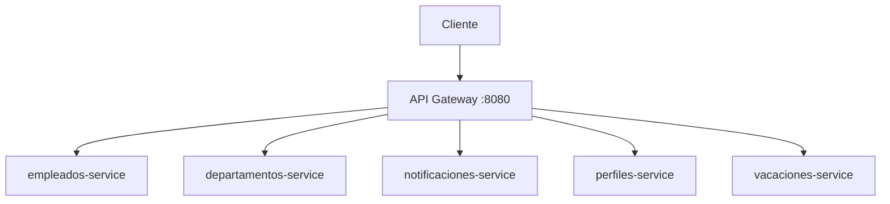

# API Gateway

API Gateway independiente de la plataforma RHM. Recibe las solicitudes HTTP de los clientes y las enruta hacia los microservicios de empleados, departamentos, notificaciones, perfiles y vacaciones, manteniendo al Gateway como punto de entrada externo.

## Arquitectura



El Gateway no contiene lógica de negocio, acceso a bases de datos ni validaciones de empleados, departamentos, notificaciones, perfiles o vacaciones. Su responsabilidad es actuar como proxy HTTP entre el cliente y los servicios upstream.

En la integración Docker Compose actual, los destinos internos son:

- `empleados-service:8080`
- `departamentos-service:80`
- `notificaciones-service:8080`
- `perfiles-service:8080`
- `vacaciones-service:8080`

## Responsabilidades

El Gateway:

- recibe solicitudes de los clientes;
- enruta las solicitudes a los microservicios configurados;
- conserva el método HTTP, la ruta, los parámetros de consulta, los headers y el body cuando corresponde;
- devuelve la respuesta del servicio upstream;
- responde con `503 Service Unavailable` cuando un upstream no está disponible;
- proporciona su propio endpoint de salud;
- **valida el JWT de cada petición y aplica las reglas de autorización** antes de enrutar (Reto 5).

## Rutas

Las rutas se definen en `src/server.ts`.

| Ruta | Destino | Descripción |
|---|---|---|
| `GET /health` | API Gateway | Comprueba que el Gateway está disponible. |
| `/empleados/*` | `EMPLEADOS_SERVICE_URL` | Proxy hacia el servicio de empleados. El Gateway no restringe el método HTTP; el servicio destino procesa la solicitud. |
| `/departamentos/*` | `DEPARTAMENTOS_SERVICE_URL` | Proxy hacia el servicio de departamentos. El Gateway no restringe el método HTTP; el servicio destino procesa la solicitud. |
| `/notificaciones/*` | `NOTIFICACIONES_SERVICE_URL` | Proxy hacia el servicio de notificaciones (solo lectura: `GET /notificaciones` y `GET /notificaciones/{empleadoId}`). |
| `/perfiles/*` | `PERFILES_SERVICE_URL` | Proxy hacia el servicio de perfiles (`GET /perfiles`, `GET /perfiles/{empleadoId}`, `PUT /perfiles/{empleadoId}`). |
| `/vacaciones/*` | `VACACIONES_SERVICE_URL` | Proxy hacia el servicio de vacaciones (`POST`, `GET`, `DELETE /vacaciones[/{id}]`). |
| `/auth/*` | `AUTH_SERVICE_URL` | Proxy hacia el servicio de autenticación (`POST /auth/login`, `recover-password`, `reset-password`, `change-password`). |

Las rutas proxy utilizan `http-proxy-middleware` con `changeOrigin: true` y conservan la ruta solicitada.

## Seguridad (Reto 5)

El Gateway valida el token antes de enrutar. Si la firma no cuadra, el token expiró o no viene, la
petición no llega al microservicio: se corta aquí.

### Por qué aquí y no en cada servicio

El enunciado deja elegir entre validar en el Gateway o poner un interceptor en cada microservicio.
Se eligió el Gateway, y la razón es el costo de la alternativa: el ecosistema tiene seis servicios
de negocio en cinco lenguajes, así que un interceptor por servicio significaría escribir la
verificación de firma cinco veces, con cinco librerías distintas, y mantener sincronizadas cinco
copias de las mismas reglas de autorización.

El argumento se ve mejor mirando hacia adelante: el Reto 10 traslada la validación a JWKS contra un
Identity Provider. Con la lógica centralizada eso es cambiar un archivo.

La contrapartida es que los microservicios confían en que lo que les llega ya fue validado. Es
aceptable porque ninguno publica puerto al host: solo se les puede hablar desde dentro de la red de
Docker, y la única puerta hacia afuera es este servicio.

### Rutas abiertas

Pasan sin token, porque sin ellas no habría forma de conseguir uno:

```text
GET  /health
POST /auth/login
POST /auth/recover-password
POST /auth/reset-password
```

También quedan abiertas las páginas de documentación de cada servicio (`/docs` y `/openapi.json`).
El enunciado pide poder obtener el token desde Swagger, y esas páginas no exponen datos del
negocio.

### Reglas de autorización

```text
si rol == ADMIN                         → permitir
si rol == USER y el método es de lectura → permitir
si rol == USER y POST /auth/change-password → permitir
si rol == USER y PUT /perfiles/{id} con id == token.sub → permitir
en cualquier otro caso                  → 403 Forbidden
```

Las dos últimas reglas son lo que diferencia esto de un RBAC clásico. Un `USER` no puede escribir
en general, pero sí sobre lo suyo, y eso no se decide por el rol sino por **la propiedad del
recurso**: se compara el `empleadoId` de la URL contra el claim `sub` del token. Es lo que permite
que cada empleado administre su propio perfil sin darle permisos de administrador.

Por eso `ms-profiles` no necesitó ningún cambio: la comprobación se resuelve entera aquí, mirando
la URL.

### Tokens rechazados

Además de los que tienen firma inválida o expirada, el Gateway rechaza los **tokens de
restablecimiento de contraseña**. Están firmados con el mismo secreto que los de acceso, así que
sin ese rechazo servirían para entrar a cualquier recurso. Se distinguen por su claim `type`.

### Respuestas

| Situación | Código | `error.code` |
|---|---:|---|
| Sin cabecera `Authorization`, firma inválida, token expirado o token de restablecimiento | 401 | `UNAUTHORIZED` |
| Token válido pero el rol no permite la operación | 403 | `FORBIDDEN` |

Ambas respetan el envelope del ecosistema, igual que el `404` y el `503` que ya existían.

### Implementación

La lógica vive en `src/security.ts`, separada de `server.ts` para que el enrutamiento siga
leyéndose de un vistazo. `src/responses.ts` concentra la construcción del cuerpo de error, que
antes estaba duplicado entre el `404` y el `503`.

El `tsconfig.json` necesitó `allowImportingTsExtensions` y `rewriteRelativeImportExtensions`: el
Gateway era un único archivo y nunca había importado otro módulo propio. Son las mismas dos
opciones que `ms-employees` ya usa por el mismo motivo.

## Variables de entorno

`.env.example` muestra las variables utilizadas por el servicio.
`PORT` es opcional porque utiliza `8080` por defecto. Las variables
`EMPLEADOS_SERVICE_URL`, `DEPARTAMENTOS_SERVICE_URL`, `NOTIFICACIONES_SERVICE_URL`, `PERFILES_SERVICE_URL`, `VACACIONES_SERVICE_URL` y `AUTH_SERVICE_URL` deben estar
definidas y contener URLs válidas. `JWT_SECRET` también es obligatoria desde el Reto 5.

| Variable | Descripción | Ejemplo |
|---|---|---|
| `PORT` | Puerto HTTP donde escucha el Gateway. Si no se define, la aplicación usa `8080`. | `8080` |
| `EMPLEADOS_SERVICE_URL` | URL base del servicio de empleados. | `http://empleados-service:8080` |
| `DEPARTAMENTOS_SERVICE_URL` | URL base del servicio de departamentos. | `http://departamentos-service:80` |
| `NOTIFICACIONES_SERVICE_URL` | URL base del servicio de notificaciones. | `http://notificaciones-service:8080` |
| `PERFILES_SERVICE_URL` | URL base del servicio de perfiles. | `http://perfiles-service:8080` |
| `VACACIONES_SERVICE_URL` | URL base del servicio de vacaciones. | `http://vacaciones-service:8080` |
| `AUTH_SERVICE_URL` | URL base del servicio de autenticación. | `http://auth-service:8080` |
| `JWT_SECRET` | Secreto simétrico con el que `auth-service` firma los tokens. **Debe ser idéntico al del auth-service**: si difieren, ningún token será aceptado. Mínimo 16 caracteres. | `change_this_jwt_secret` |
| `JWT_ISSUER` | Emisor esperado en el claim `iss`. Si no se define, usa `auth-service`. | `auth-service` |

Las URLs y el secreto se validan al iniciar. El Gateway no carga automáticamente un archivo `.env`; las variables deben estar disponibles en el entorno del proceso o ser proporcionadas por Docker Compose.

## Puerto

El valor utilizado actualmente es:

```env
PORT=8080
```

En la integración actual documentada por el repositorio de infraestructura,
el Gateway se publica en el puerto `8080`. Esta configuración pertenece al
`docker-compose.yml` externo, no a este repositorio. Los microservicios permanecen dentro de la red Docker y sus URLs internas se proporcionan mediante `EMPLEADOS_SERVICE_URL`, `DEPARTAMENTOS_SERVICE_URL`, `NOTIFICACIONES_SERVICE_URL`, `PERFILES_SERVICE_URL` y `VACACIONES_SERVICE_URL`.

## Health Check

Solicitud:

```http
GET /health
```

Respuesta:

```json
{
  "success": true,
  "message": "API Gateway disponible",
  "data": {
    "status": "UP"
  }
}
```

El `Dockerfile` utiliza este endpoint para su healthcheck.

## Manejo de errores

Si el proxy no puede comunicarse con el servicio upstream, responde con
HTTP `503`. Si el upstream responde con un código HTTP válido, el Gateway
reenvía esa respuesta.

Cuando ocurre un error de comunicación con el upstream, la respuesta utiliza
el siguiente formato:

```json
{
  "success": false,
  "message": "Servicio upstream no disponible",
  "data": null,
  "error": {
    "code": "UPSTREAM_SERVICE_UNAVAILABLE"
  }
}
```

Las rutas no reconocidas por el Gateway responden con HTTP `404` y el código `RESOURCE_NOT_FOUND`.

## Instalación local

Requisitos:

- Node.js compatible con el proyecto;
- npm.

Instalar dependencias (para `npm run typecheck` / `npm run build`, no para servir tráfico real):

```bash
npm install
```

Desde `rhm-database-infrastructure` (Reto 3), `empleados-service`, `departamentos-service`,
`notificaciones-service`, `perfiles-service` y `vacaciones-service` ya no publican sus puertos al
host: solo son alcanzables como `empleados-service:8080`, `departamentos-service:80`,
`notificaciones-service:8080`, `perfiles-service:8080` y `vacaciones-service:8080` dentro de
`microservices-network`. Por eso el Gateway **no puede** apuntar a upstreams reales corriendo fuera
de Docker (`http://localhost:8080` / `http://localhost:8081` ya no responden). El único flujo
soportado para correr el Gateway contra los servicios reales es Docker Compose:

```bash
cd ../rhm-database-infrastructure
docker compose up --build
```

`npm run dev` / `npm start` siguen sirviendo para iterar sobre el código del propio Gateway, pero
`EMPLEADOS_SERVICE_URL`, `DEPARTAMENTOS_SERVICE_URL`, `NOTIFICACIONES_SERVICE_URL`, `PERFILES_SERVICE_URL` y `VACACIONES_SERVICE_URL` deben apuntar a
upstreams que tú mismo levantes y expongas al host (por ejemplo, corriendo esos servicios sueltos
con Docker y `-p`); no hay una URL de `localhost` provista por la infraestructura oficial para ese
uso.

## Desarrollo y ejecución

Scripts disponibles en `package.json`:

```bash
npm run dev
npm start
npm run typecheck
npm run build
```

- `npm run dev`: ejecuta el servidor con watch y `--experimental-strip-types`.
- `npm start`: ejecuta `dist/server.js`; requiere haber compilado previamente.
- `npm run typecheck`: verifica los tipos sin generar archivos.
- `npm run build`: compila `src` en `dist`.

Para ejecutar la versión compilada:

```bash
npm run build
npm start
```

## Ejecución con Docker

El `Dockerfile` usa una construcción multietapa basada en Node.js 24 Alpine. Instala las dependencias con `npm ci`, compila TypeScript, elimina dependencias de desarrollo y ejecuta `dist/server.js` con un usuario no privilegiado.

Construir la imagen desde este repositorio:

```bash
docker build -t api-gateway .
```

Para ejecutar el contenedor de forma independiente, las variables
`EMPLEADOS_SERVICE_URL`, `DEPARTAMENTOS_SERVICE_URL`, `NOTIFICACIONES_SERVICE_URL`, `PERFILES_SERVICE_URL` y `VACACIONES_SERVICE_URL` deben apuntar a
upstreams realmente accesibles desde el contenedor.

No se deben apuntar al puerto publicado por el propio Gateway. En Docker
Compose, se deben utilizar los nombres DNS de los servicios de la red
compartida.

## Integración con Docker Compose

El Gateway es un repositorio independiente. El repositorio `rhm-database-infrastructure` lo consume como contexto de construcción mediante:

```yaml
api-gateway:
  build:
    context: ../api-gateway
    dockerfile: Dockerfile
```

El `docker-compose.yml` no pertenece a este repositorio. Desde `rhm-database-infrastructure`, el Gateway se conecta a `microservices-network` y recibe:

```yaml
PORT: 8080
EMPLEADOS_SERVICE_URL: http://empleados-service:8080
DEPARTAMENTOS_SERVICE_URL: http://departamentos-service:80
NOTIFICACIONES_SERVICE_URL: http://notificaciones-service:8080
PERFILES_SERVICE_URL: http://perfiles-service:8080
VACACIONES_SERVICE_URL: http://vacaciones-service:8080
```

El Gateway es el único punto de entrada HTTP de la plataforma publicado al host. Los microservicios no publican directamente sus puertos HTTP.

## Verificación

Con el Gateway ejecutándose localmente o mediante Compose:

```bash
curl -i http://localhost:8080/health
curl -i http://localhost:8080/empleados
curl -i http://localhost:8080/departamentos
curl -i http://localhost:8080/notificaciones
curl -i http://localhost:8080/perfiles
curl -i http://localhost:8080/vacaciones
```

La primera solicitud comprueba el Gateway. Las demás comprueban el proxy hacia cada microservicio. En Compose, los upstreams se consumen internamente mediante nombres de servicio Docker.

## Relación con el Reto 3

Como parte del Reto 3, el Gateway fue separado del repositorio de infraestructura y publicado como un repositorio independiente. La infraestructura lo incorpora mediante el contexto relativo `../api-gateway`.

La arquitectura final mantiene:

- el Gateway como punto de entrada externo;
- empleados, departamentos, notificaciones, perfiles y vacaciones como servicios internos;
- comunicación entre contenedores mediante nombres de servicio Docker;
- ningún puerto HTTP de los microservicios publicado directamente al host.

El Circuit Breaker pertenece a `ms-employees`, que es el servicio consumidor de departamentos. No forma parte de este Gateway.

## Relación con el Reto 4

`notificaciones-service` es puramente reactivo (consume eventos de RabbitMQ) pero también expone
lectura vía REST (`GET /notificaciones`, `GET /notificaciones/{empleadoId}`).
`perfiles-service` combina ambos estilos: reactivo (consume `empleado.creado`/`empleado.actualizado`/
`empleado.retirado`) y REST (`GET /perfiles`, `GET /perfiles/{empleadoId}`,
`PUT /perfiles/{empleadoId}`). `vacaciones-service` es productor además de exponer REST: expone
`POST`/`GET`/`DELETE /vacaciones[/{id}]` hacia RRHH y publica `vacaciones.programadas` al
programar un período exitosamente. El Gateway trata a los cinco por igual: un proxy más, sin
lógica adicional. Con esto el Reto 4 queda completo.

## Repositorios relacionados

- [API Gateway](https://github.com/Microservicios-RHM/api-gateway)
- [Infraestructura](https://github.com/Microservicios-RHM/rhm-database-infrastructure)
- [Employees](https://github.com/Microservicios-RHM/ms-employees)
- [Departments](https://github.com/Microservicios-RHM/ms-departments)
- [Notifications](https://github.com/Microservicios-RHM/ms-notifications)
- [Profiles](https://github.com/Microservicios-RHM/ms-profiles)
- [Vacation](https://github.com/Microservicios-RHM/ms-vacation)

## Decisiones de diseño

- El Gateway se mantiene como repositorio independiente para separar su ciclo de vida del repositorio de infraestructura.
- La comunicación en Docker utiliza nombres DNS de servicios, como `empleados-service`, `departamentos-service`, `notificaciones-service`, `perfiles-service` y `vacaciones-service`.
- El Gateway concentra el acceso HTTP externo en el puerto `8080`.
- Los microservicios mantienen sus puertos HTTP internos y no se publican directamente al host.
- El Gateway no implementa lógica de negocio ni accede a las bases de datos.
